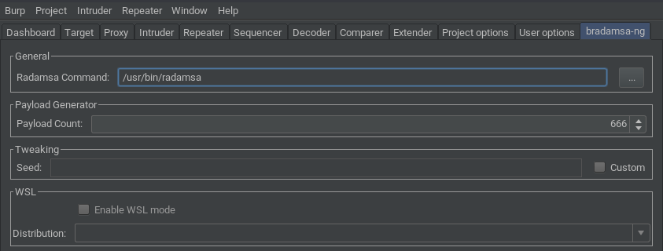
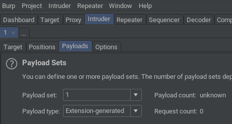
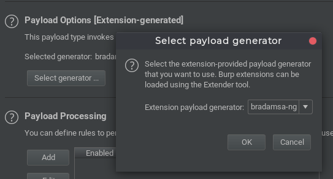

# bradamsa-ng

*A Burp Suite extension for Radamsa-powered fuzzing with Intruder*

## Index

- [bradamsa-ng](#bradamsa-ng)
  - [Index](#index)
  - [Introduction](#introduction)
  - [Requirements](#requirements)
  - [Installation](#installation)
  - [Building](#building)
  - [Usage](#usage)
    - [Intruder Payload Generator](#intruder-payload-generator)
    - [Intruder Payload Processor](#intruder-payload-processor)
    - [WSL mode](#wsl-mode)

## Introduction

*bradamsa-ng* is a [Burp Suite](https://portswigger.net/burp/) extension that brings the power of the amazing 
[Radamsa](https://gitlab.com/akihe/radamsa) fuzzer to Intruder. It is heavily
influenced by the original [*bradamsa* by *ikkisoft*](https://github.com/ikkisoft/bradamsa) 
and aims to fix some of its weaknesses while building upon its strengths.

One noteworthy feature of *bradamsa-ng* is its support for [WSL](https://docs.microsoft.com/en-us/windows/wsl/about).  
Radamsa is (understandably) not developed with Windows in mind, which means that 
there is no official support for it. There was a solution to [build Radamsa using Cygwin](https://github.com/aoh/radamsa/issues/31#issuecomment-266049451),
but it didn't reliably work for me - and there's simply no guarantee that it'll work forever.  
  
With WSL however, we can compile and run Radamsa in its natural habitat - hell, 
we can even run it from the Windows host (`echo "test" | wsl -d Ubuntu -e radamsa`).
With *bradamsa-ng*, these new possibilities can now be leveraged in Burp.

## Requirements

* Java >= 8 ([Burp >= 2.0.14 ships with OpenJDK 11](https://twitter.com/Burp_Suite/status/1088829534600921090))
* Burp Suite obviously

## Installation

* [Build](#building) the extension or download a [release](https://github.com/nscuro/bradamsa-ng/releases)
* Open Burp and navigate to the *Extender* tab
* Click *Add*
* In the dialog that just opened, select the extension type *Java*
* Click *Find File* and select your `bradamsa-ng-${version}-jar-with-dependencies.jar`
* Click *Next* - that's it

*bradamsa-ng* tries to automatically detect a *Radamsa* binary in your `$PATH`. If this succeeds, you'll
see a message saying 

> Radamsa binary was found at /some/path/radamsa 

in the extension's *Output* tab.

Likewise, when running on Windows and WSL is available, you'll either see

>WSL is available, but no installed distributions have been found

or 

> WSL is available and the following distributions have been found: [Ubuntu, Kali]

depending on if WSL distributions are installed or not.

## Building

* Linux / macOS: `./mvnw clean package`
* Windows: `mvnw.cmd clean package`

The installable extension JAR can now be found at `target/bradamsa-ng-${version}-jar-with-dependencies.jar`

## Usage

### Intruder Payload Generator

* In Intruder's *Payloads* tab, select the payload type *Extension-generated*:
  
* Next, choose *bradamsa-ng* as generator under *Payload Options*:
  
* Set the amount of payloads you want to generate in the *bradamsa-ng* tab under *Payload Count*
  * **All** payloads will be generated before the first request is sent
* Start the Intruder attack
  * Please note that the *Battering Ram* attack is not supported

### Intruder Payload Processor

Not implemented yet.

### WSL mode

*bradamsa-ng* supports using Radamsa through Windows 10's *Windows Subsystem for Linux*.  
In order to take advantage of it, you need the following:

* Windows 10 with WSL installed
  * Instructions to install WSL can be found [here](https://docs.microsoft.com/en-us/windows/wsl/install-win10)
* At least one installed WSL distribution (e.g. [Ubuntu](https://www.microsoft.com/en-us/p/ubuntu/9nblggh4msv6))
* [Radamsa](https://gitlab.com/akihe/radamsa) installed in at least one of the distributions
  * Using `sudo make install` will make it easier for *bradamsa-ng* to find the Radamsa binary

* The extension will let you know if WSL is available on startup as mentioned in [Installation](#installation)
* Switch to the *bradamsa-ng* tab and tick the *Enable WSL mode* checkbox
* Select the distribution where *Radamsa* is installed in
* *bradamsa-ng* will attempt to automatically find a Radamsa binary in the selected distro's `$PATH`
  * If this fails you can manually enter the **absolute** path to the binary **inside the WSL distro**
  * At this point, *bradamsa-ng* will simply check if the entered value points to an existing file **or** is a command that can be found in the distro's `$PATH`
