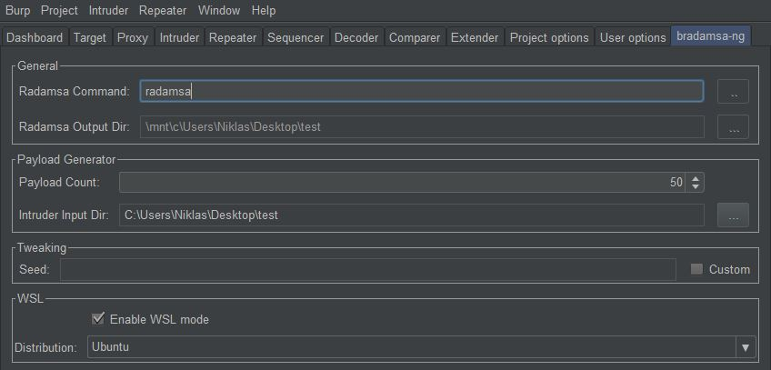

# bradamsa-ng

*A Burp Suite extension for Radamsa-powered fuzzing in Intruder*

## Introduction

*bradamsa-ng* is a Burp Suite extension that brings the power of the amazing 
[Radamsa](https://gitlab.com/akihe/radamsa) fuzzer to Intruder. It is heavily
influenced by the original [*bradamsa* by *ikkisoft*](https://github.com/ikkisoft/bradamsa) 
and aims to fix some of its weaknesses while building upon its strengths.

One noteworthy feature of *bradamsa-ng* is its support for WSL.  
Radamsa is (understandably) not developed with Windows in mind, which means that 
there is no official support for it. There was a solution to [build Radamsa using Cygwin](https://github.com/aoh/radamsa/issues/31#issuecomment-266049451),
but it didn't reliably work for me - and there's simply no guarantee that it'll work forever.  
With WSL however, we can compile and run Radamsa in its natural habitat - hell, 
we can even run it from the Windows host (`echo "test" | wsl -d Ubuntu -e radamsa`).
With *bradamsa-ng*, these new possibilities can now be leveraged in Burp.

## Installation

TODO

## Building

TODO

## Usage

### Intruder Payload Generator

TODO

### Intruder Payload Processor

TODO

### WSL mode

*bradamsa-ng* supports using Radamsa through Windows 10's *Windows Subsystem for Linux*.  
In order to take advantage of it, you need the following:

* Windows 10 with WSL installed
  * Instructions to install WSL can be found [here](https://docs.microsoft.com/en-us/windows/wsl/install-win10)
* At least one installed WSL distribution (e.g. [Ubuntu](https://www.microsoft.com/en-us/p/ubuntu/9nblggh4msv6))
* [Radamsa](https://gitlab.com/akihe/radamsa) installed in at least one of the distributions

The extension will let you know if WSL is available on startup.  
For example, after successful installation you'll see something like this in the output tab:

Switch to the *bradamsa-ng* tab and tick the *Enable WSL mode* checkbox. 
Select the distribution where *Radamsa* is installed in and choose an input directory for Intruder payloads. 
The extension will automatically convert this to an equivalent output directory for *Radamsa* inside your WSL distro.
Lastly, make sure you provide a valid *Radamsa* command. If you installed *Radamsa* with `make install` or its binary
is in your WSL distro's *PATH*, the command `radamsa` should be fine. Otherwise, input an *absolute* path to your *Radamsa*
executable, e.g. `/home/username/.local/bin/radamsa`.
